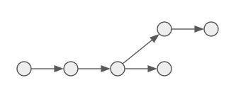

# cs415-project02 -- Satellite Deployment Optimization


<!--  -->

## Contributors:

- [Soren Richenberg](https://github.com/sorenrichenberg)
- [Owen Mastropietro](https://github.com/OwenMastropietro)

## Build and Run Instructions:

```bash
# configure cmake

# build the project
mkdir build
cd build
cmake ..
make

# run the project
./topo-sort

# test the project
./topo-test
```

## Project Description:

Exploring **Topological Sorting** to optimize the planning and execution of satellite deployment missions, maximizing profitability and efficiency, ensuring timely and cost-effective delivery of satellite payloads into their designated orbits.

### Benefits

- Maximizes revenue potential by prioritizing high-value satellite deployment missions.
- Minimizes operational costs through efficient resource allocation and scheduling.
- Enhances user satisfaction by ensuring timely and reliable satellite deployments.

## Building Blocks

### Directed Acyclic Graph



A Directed Acyclic Graph (DAG) is a directed graph which contains no cycles such that no edge connecting two vertices can create a closed loop.

#### Representation

We may choose to represent a DAG as follows:

- a) Visual / Theoretical
- b) Adjacency List
- c) Adjacency Matrix


We chose to use an Adacency List to represent our DAG due to the following Asymtotic Complexity improvements: [^1]

| Operation         | Adjacency List                   | Adjacency Matrix                     |
| ----------------- | -------------------------------- | ------------------------------------ |
| Space Complexity  | O(\|V\| + \|E\|)<sub>worst</sub> | O(\|V\|<sup>2</sup>)<sub>worst</sub> |
| Adding a Vertex   | O(1)                             | O(\|V\|<sup>2</sup>)                 |
| Adding an Edge    | O(1)                             | O(1)                                 |
| Removing a Vertex | O(\|V\| + \|E\|)                 | O(\|V\|<sup>2</sup>)                 |

### Bredth-First Search & Depth-First Search Algorithms


Bredth-First Search, BFS, and Depth-First Search, DFS, are both graph traversal algorithms with O(|V| + |E|) time complexity.

```python
# iterative bfs pseudo code
marked = [False] * G.size()
def BFS(G,v):
  queue = [v]
  while len(queue) > 0:
    v = queue.pop(0)
    if not marked[v]:
      visit(v) # pre-order
      marked[v] = True
      for w in G.neighbors(v):
        if not marked[w]:
          queue.append(w)
```

```python
# iterative dfs pseudo code
marked = [False] * G.size()
def DFS(G,v):
  stack = [v]
  while(len(stack) > 0):
    v = stack.pop()
    if not marked[v]:
    visit(v)
    marked[v] = True
    for w in G.neighbors(v):
      if not marked[w]:
        stack.append(w)
```

Iterative BFS on a DAG. [^2]

```c++
// iterative bfs on a DAG
static void bfs_topological_sort(Graph g) {
    Queue Q = new LQueue(G.node_count());
    int[] counts = new int[G.node_count()];
    int[] neighbor_list;

    // Initialize
    for (int v = 0; v < v.node_count(); v++) {
        counts.at(v) = 0;
    }

    // Process edges
    for (int v = 0; v < node_count(); v++) {
        neighbor_list = G.neighbors(v);
        // Add to v's prereq count
        for (int i = 0; i < neighbor_list.length(); i++) {
            counts.at(neighbor_list.at(i))++;
        }
    }

    // Initialize Queue
    for (int v = 0; v < G.node_count(); v++) {
        if (counts.at(v) == 0) {
            Q.enqueue(v);
        }
    }

    // Process Vertices
    while (Q.length() > 0) {
        v = (int)Q.dequeue();
        print(v); // pre-visit
        neighbor_list = G.neighbors(v);
        for (int i = 0; i < neighbor_list.length(); i++) {
            counts.at(neighbor_list.at(i))--; // One less prereq
            // This vertex is now free
            if (counts.at(neighbor_list.at(i)) == 0) {
                Q.enqueue(neighbor_list.at(i));
            }
        }
    }
}
```

### Topological Sort

Topological sorting involves utilizing a graph search algorithm to traverse a set of vertices in a DAG, yielding a linear ordering of its vertices such that, for each directed edge U->V, U precedes V in the ordering. This makes it useful in applications including:

1. finding cycles in graphs.
2. deadlock detection in operating systems.
3. satellite ground station scheduling.
4. dependency resolution.
5. data serialization.

## Useful Resources

- [Topological Sorting Applications](https://iq.opengenus.org/applications-of-topological-sort/#:~:text=The%20Applications%20of%20Topological%20Sort,Dependency%20resolution)
- [Bredth-First Search (BFS) -- Reducible](https://www.youtube.com/watch?v=xlVX7dXLS64)
- [Depth-First Search (DFS) -- Reducible](https://www.youtube.com/watch?v=PMMc4VsIacU)

### Footnotes

[^1]: Extra Credit Oportunity: Implement an Adjacency List in place of the inferior Adjacency Matrix.
[^2]: Extra Credit Oportunity: Implement an iterative, Queue-Based Source Removal Algorithm in place of DFS.
