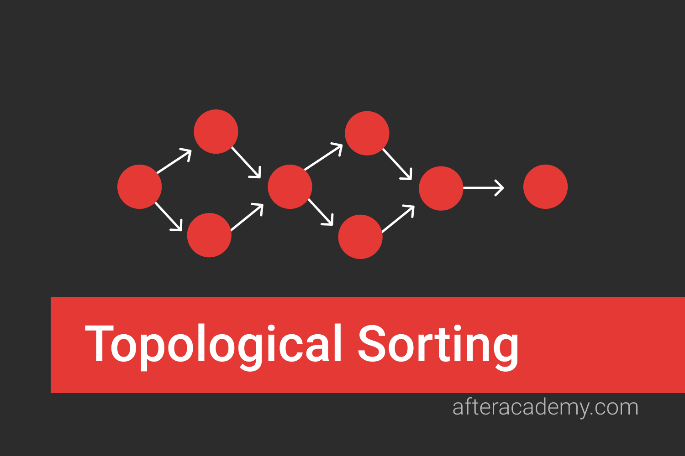
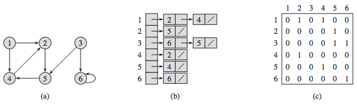

# Topological Sorting -- CS415 Project 2


## Contributors:
- [Soren Richenberg](https://github.com/sorenrichenberg)
- [Owen Mastropietro](https://github.com/OwenMastropietro)

## Instructions To Run:
  1. `$ make`
  2. `$ ./topological_sort.out`
  3. Follow the prompts for entering significant data.

## Project Reflection/Notes... work-in-progress:
- **Motivation:** For this project, we were tasked with thinking from the perspective of a rental agency or an owner of an Airbnb owner wanting to retain an ordered list of clients to rent to.
- **Example:** Consider a property that will be available for rental all year with multiple clients that can rent it out for various times. Consider also the following clients ....
TODO 

property is available for one year, there is a chance that renting to a smaller chain of clients will yield more revenue than a larger chain of clients depending on how much each client is paying and when they will be booked. This implementation gives us a real-world perspective in utilizing the deacrease-and-conquer approach for topologically sorting.
  - *Additional constraints to account for filtration of "bad" clients?*
  - *I wonder how I can apply this in a machine learning approach?*

- **Input:** Text file containing three pieces of client information per line in the form of three integers. You can expect to there to be a move-in (start) date followed by a move-out date (end) date, followed by the amount of money (revenue) they will pay for that duration.

- **Output:** Can output directly to screen or to files with user provided input. Will provide information on about the number of clients being considered in a particular sample input data, the optimal revenue that can be earned given the dataset, and the particular optimal subset of clients - which clients will be chosen to - contribute to the optimal revenue earned.

- **Context:** In order to employ a decrease-and-conquer approach to achieving this we considered a directed-acyclic-graph-based (DAG) approach such that we could employ a source-removal algorithm, such as Depth First Search (DFS), to ensure all vertices in the graph are visisted - all clients in the sample data set are considered - while constructing an optimal subset of those clients to provide services to in order to achieve the maximum possible revenue. In representing this DAG, an adjacency list was chosen over an adjacency matrix because of it's potentially limiting space taken by entries in the matrix that don't correspond to useful data. This comes at the cost of time int searching the adjacency list. In an effort to offset the additional cost of time from our spacially-improved adjacency list representation, a queue-based source-removal algorithm was chosen over a DFS-based source-removal algorithm in order to reduce the time overhead stemming from the recursive calls made in the DFS approach.

## Directed Acyclic Graph

A **Directed Acyclic Graph, a DAG**, is a directed graph which contains no cycles such that no edge connecting two vertices can create a closed loop.
### *Representation:*
We can represent a DAG as follows:
  a) Visual / Theoretical
  b) Adjacency List
  c) Adjacency Matrix



### *We chose to use an Adacency List to represent our DAG due to the following Asymtotic Complexity improvements:* [^1]

| Operation | Adjacency List | Adjacency Matrix |
| ------ | ------ | ------ |
| Space Complexity | O(V + E)<sub>worst</sub> | O(V<sup>2</sup>)<sub>worst</sub> |
| Adding a Vertex | O(1) | O(V<sup>2</sup>) |
| Adding an Edge | O(1) | O(1) |
| Removing a Vertex | O(V + E) | O(V<sup>2</sup>) |


## Bredth-First Search & Depth-First Search Algorithms


**Bredth-First Search, BFS, and Depth-First Search, DFS,** are both graph traversal algorithms with O(V + E) time complexity. Use BFS for deep trees, DFS for broad trees (BFS is memory space hungry).

**BFS Implementation**
```python
# Iterative Approach
marked = [False] * G.size()
def BFS(G,v):
  queue = [v]
  while len(queue) > 0:
    v = queue.pop(0)
    if not marked[v]:
      visit(v) # Pre-order
      marked[v] = True
      for w in G.neighbors(v):
        if not marked[w]:
          queue.append(w)
```

**DFS Implementation**
```python
# Iterative Approach
marked = [False] * G.size()
def DFS(G,v):
  stack = [v]
  while(len(stack) > 0):
    v = stack.pop()
    if not marked[v]:
    visit(v)
    marked[v] = True
    for w in G.neighbors(v):
      if not marked[w]:
        stack.append(w)
```

```python
# Recursive Approach - (Pre-order)
marked = [False] * G.size()
def DFS(G,v):
  visit(v) # Pre-order
  marked[v] = True
  for w in G.neighbors(v):
    if not marked[w]:
      DFS(G, w)
```

```python
# Recursive Approach - (Post-order)
marked = [False] * G.size()
def DFS(G,v):
  marked[v] = True
  for w in G.neighbors(v):
    if not marked[w]:
      DFS(G, w)
  visit(v) # Post-order
```
*The above mentioned algorithms will both run in O(|v| + |E|) for both the iterative and recursive approaches.*

## Topological Sorting Algorithms


**Topological sorting** a set of vertices in a DAG yields a linear ordering of its vertices such that, for every directed edge UV, U precedes V in the ordering. This makes it useful in applications such as:
1. Finding a cycle in a graph.
2. Operating System deadlock detection
3. Dependency Resolution
4. Critical Path Analysis
5. Data Serialization


**Using a Recursive Depth-First Search on a DAG.**
```c++
static void DFS_topological_sort(Graph g)
{
  for (int v = 0; v < G.node_count(); v++)
  {
    G.set_value(v, null); // Initialize
  }
  for (int v = 0; v < G.node_count(); v++)
  {
    if (G.get_value(v) != visited)
    {
      DFS(G, v);
    }
  }
}

static void DFS(Graph G, int v)
{
  G.set_value(v, visited);
  int[] neighbor_list = G.neighbors();
  for (int i = 0; i < neighbor_list.length(); i++)
  {
    if (G.get_value(neighbor_list.at(i)) != visited)
    {
      DFS(G, neighbor_list.at(i));
    }
  }
}
```

**Using an Iterative Bredth-First Search on a DAG.** [^2]
```c++
static void BFS_topological_sort(Graph g)
{
  Queue Q = new LQueue(G.node_count());
  int[] count = new int[G.node_count()];
  int[] neighbor_list;
  // Initialize
  for (int v = 0; v < v.node_count(); v++)
  {
    count.at(v) = 0;
  }
  // Process every edge
  for (int v = 0; v < node_count(); v++)
  {
    neighbor_list = G.neighbors(v);
    // Add to v's prereq count
    for (int i = 0; i < neighbor_list.length(); i++)
    {
      count.at(neighbor_list.at(i))++;
    }
  }
  // Initialize Queue
  for (int v = 0; v < G.node_count(); v++)
  {
    if (count.at(v) == 0)
    {
      Q.enqueue(v);
    }
  }
  // Process Vertices
  while (Q.length() > 0)
  {
    v = (int)Q.dequeue();
    print(v); // Previsit
    neighbor_list = G.neighbors(v);
    for (int i = 0; i < neighbor_list.length(); i++)
    {
      count.at(neighbor_list.at(i))--; // One less prereq
      // This vertex is now free
      if (count.at(neighbor_list.at(i)) == 0)
      {
        Q.enqueue(neighbor_list.at(i));
      }
    }
  }
}
```
## Useful Resources
- [Topological Sorting Applications](https://iq.opengenus.org/applications-of-topological-sort/#:~:text=The%20Applications%20of%20Topological%20Sort,Dependency%20resolution)
- [Bredth-First Search (BFS) -- Reducible](https://www.youtube.com/watch?v=xlVX7dXLS64)
- [Depth-First Search (DFS) -- Reducible](https://www.youtube.com/watch?v=PMMc4VsIacU)

<!-- FootNotes -->
[^1]: Extra Credit Oportunity: Implement an Adjacency List in place of the inferior Adjacency Matrix.
[^2]: Extra Credit Oportunity: Implement an iterative, Queue-Based Source Removal Algorithm in place of DFS.