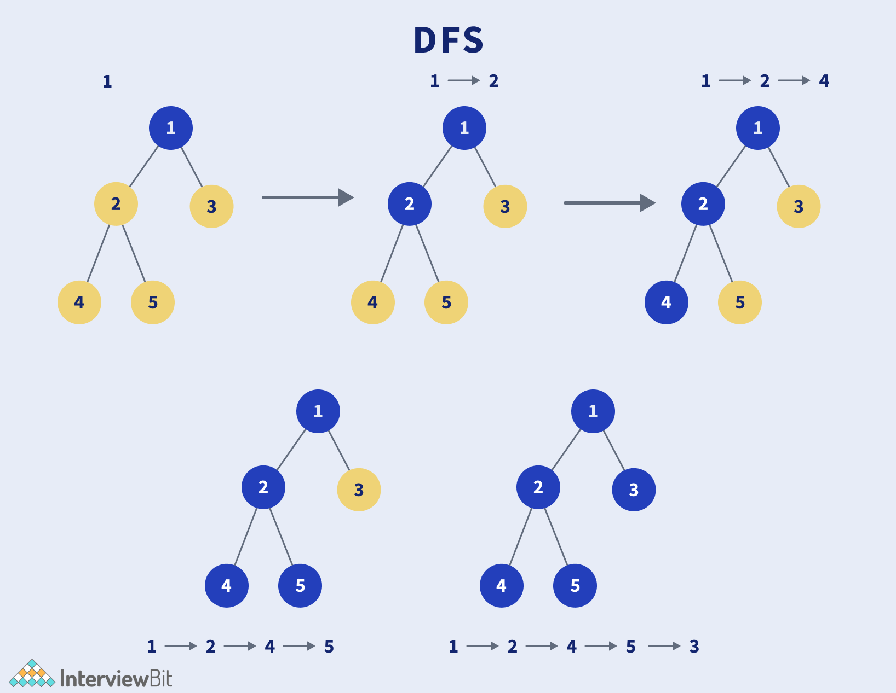

# Topological Sorting -- CS415 Project 2


## Contributors:
- [Soren Richenberg](https://github.com/sorenrichenberg)
- [Owen Mastropietro](https://github.com/OwenMastropietro)

## Instructions To Run:
  1. `$ make`
  2. `$ ./topological_sort.out`
  3. Follow the prompts for entering significant data.

## 2/2 Extra Credit Opportunities Successfully Pursued:
  1. Implemented Adjacency List in place of the inferior Adjacency Matrix.
  2. Implemented Queue-Based Source Removal Algorithm in place of DFS.

## Project Reflection/Notes... work-in-progress:
- **Motivation:** Rental properties or Airbnb's need to efficiently select a chain of clients that will yield the maximum total revenue over a given period of time. For example, if a property is available for one year, there is a chance that renting to a smaller chain of clients will yield more revenue than a larger chain of clients depending on how much each client is paying and when they will be booked. This implementation gives us a real-world perspective in utilizing the deacrease-and-conquer approach for topologically sorting.
  - *Additional constraints to account for filtration of "bad" clients?*
  - *I wonder how I can apply this in a machine learning approach?*

- **Input:** Text file containing three pieces of client information per line in the form of three integers. You can expect to there to be a move-in (start) date followed by a move-out date (end) date, followed by the amount of money (revenue) they will pay for that duration.

- **Output:** Can output directly to screen or to files with user provided input. Will provide information on about the number of clients being considered in a particular sample input data, the optimal revenue that can be earned given the dataset, and the particular optimal subset of clients - which clients will be chosen to - contribute to the optimal revenue earned.

- **Context:** In order to employ a decrease-and-conquer approach to achieving this we considered a directed-acyclic-graph-based (DAG) approach such that we could employ a source-removal algorithm, such as Depth First Search (DFS), to ensure all vertices in the graph are visisted - all clients in the sample data set are considered - while constructing an optimal subset of those clients to provide services to in order to achieve the maximum possible revenue. In representing this DAG, an adjacency list was chosen over an adjacency matrix because of it's potentially limiting space taken by entries in the matrix that don't correspond to useful data. This comes at the cost of time int searching the adjacency list. In an effort to offset the additional cost of time from our spacially-improved adjacency list representation, a queue-based source-removal algorithm was chosen over a DFS-based source-removal algorithm in order to reduce the time overhead stemming from the recursive calls made in the DFS approach.

## DAG
- image
- description
## DFS Algorithm
Depth First Search is a graph traversal algorithm.
- *Note: The following two approaches both take O(V + E).*
```python
# Pythonic Pseudo-Code for recursive approach
marked = [False] * G.size()
def dfs(G,v):
  visit(v)
  marked[v] = True
  for w in G.neighbors(v):
    if not marked[w]:
      dfs(G, w)
```
```python
# Pythonic Pseudo-Code for iterative approach
marked = [False] * G.size()
def dfs(G,v):
  stack = [v]
  while(len(stack) > 0):
    v = stack.pop()
    if not marked[v]:
    visit(v)
    marked[v] = True
    for w in G.neighbors(v):
      if not marked[w]:
        stack.append(w)
```


## Topological Sorting Algorithms
- Recursive Depth-First Search on a DAG:
```c++
static void DFS_topological_sort(Graph g)
{
  for (int v = 0; v < G.node_count(); v++)
  {
    G.set_value(v, null); // Initialize
  }
  for (int v = 0; v < G.node_count(); v++)
  {
    if (G.get_value(v) != visited)
    {
      DFS(G, v);
    }
  }
}

static void DFS(Graph G, int v)
{
  G.set_value(v, visited);
  int[] neighbor_list = G.neighbors();
  for (int i = 0; i < neighbor_list.length(); i++)
  {
    if (G.get_value(neighbor_list.at(i)) != visited)
    {
      DFS(G, neighbor_list.at(i));
    }
  }
}
```
- Using a Queue-based Source Removal Algorithm on a DAG
```c++
static void BFS_topological_sort(Graph g)
{
  Queue Q = new LQueue(G.node_count());
  int[] count = new int[G.node_count()];
  int[] neighbor_list;
  // Initialize
  for (int v = 0; v < v.node_count(); v++)
  {
    count.at(v) = 0;
  }
  // Process every edge
  for (int v = 0; v < node_count(); v++)
  {
    neighbor_list = G.neighbors(v);
    // Add to v's prereq count
    for (int i = 0; i < neighbor_list.length(); i++)
    {
      count.at(neighbor_list.at(i))++;
    }
  }
  // Initialize Queue
  for (int v = 0; v < G.node_count(); v++)
  {
    if (count.at(v) == 0)
    {
      Q.enqueue(v);
    }
  }
  // Process Vertices
  while (Q.length() > 0)
  {
    v = (int)Q.dequeue();
    print(v); // Previsit
    neighbor_list = G.neighbors(v);
    for (int i = 0; i < neighbor_list.length(); i++)
    {
      count.at(neighbor_list.at(i))--; // One less prereq
      // This vertex is now free
      if (count.at(neighbor_list.at(i)) == 0)
      {
        Q.enqueue(neighbor_list.at(i));
      }
    }
  }
}
```